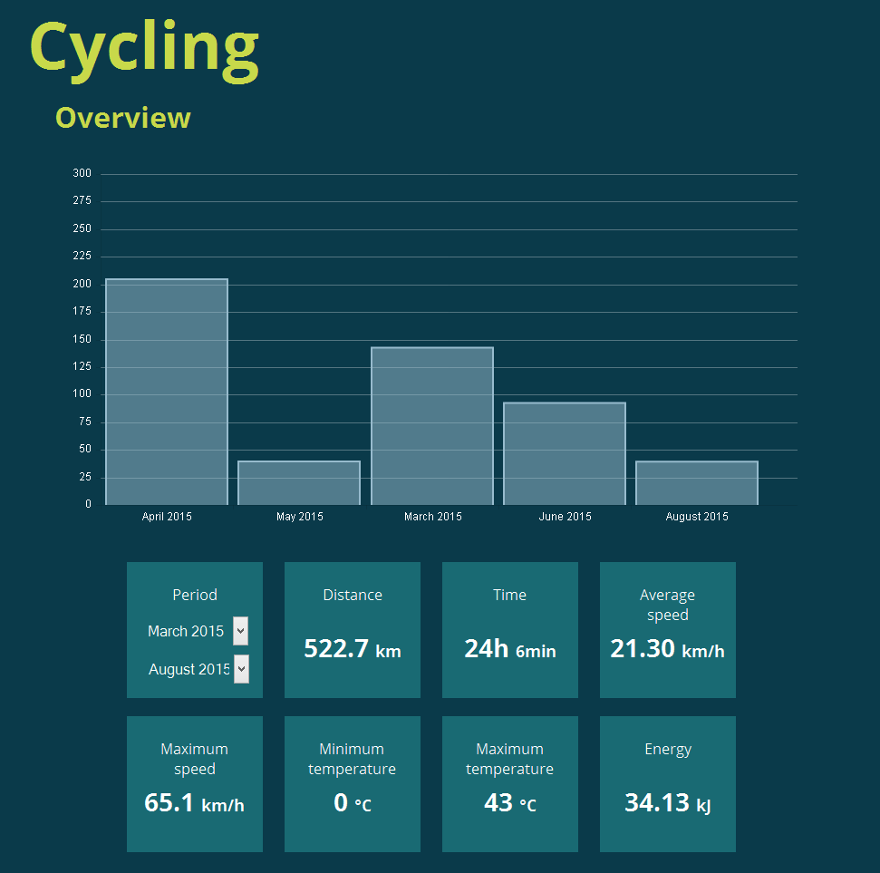
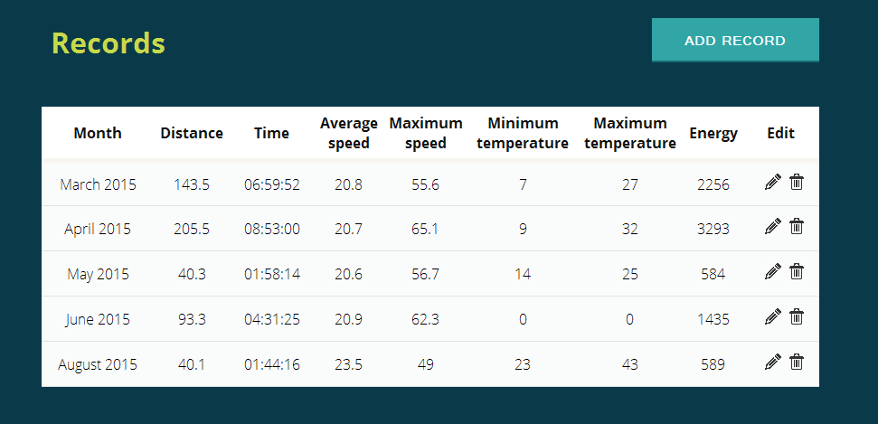
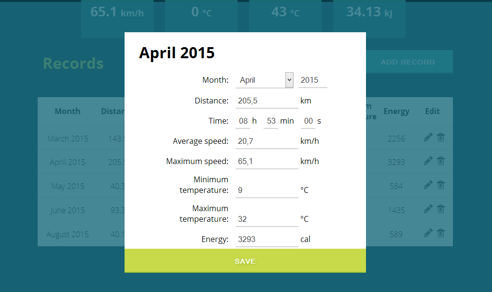

# Cycling stats
This is a simple tool for tracking cycling stats. You must insert data (distance, time, average speed, ...) from your cycling computer each month and then reset it. Default app interface language is Slovenian, but you can switch to English as well.

# Features
* Storing/editing cycling computer data
* Viewing data in table
* Overall calculations for desired period
* Graphical presentation

# Technologies
* PHP with MySQL database
* Javascript
* HTML and CSS

# Installation
You will need a PHP server with MySQL database
* Clone repository in a shared folder
* Import MySQL table structure
* Configure MySQL credentials and interface language in config.php if necessary
* You are done :)

# Screenshots

## Overview

## Records

## Record editing

